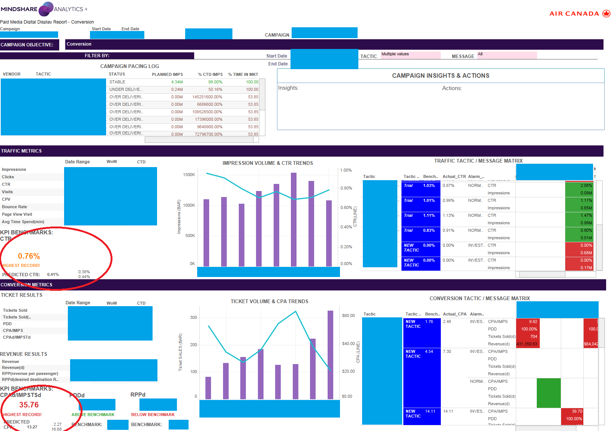

## Mindshare Analytics Product
### Disclaimer
- The data sections are censored for security purpose
- This project is just for demonstration purpose

### Air Canada Campaign Performance Predictive Tool

 

### Integrated Campaign Dashboard

 

# Product details

## Problems:
- When planning new campaigns, planners can only use past, similar campagins' performance, to estimate the new campaign. 
- It does not accurately predict each tactics/vendors' performance
- Past data are too huge/complicated to use, to predict the new campaigns' performance.

## Predictive Tool
- Utilize historical data, and build data library for each tactic/vendor used in all time.
- Predict a campaign's performance at planning phase, as accurate as on tactic/vendor level.
- Campaign A|B testing: based on the outputs of the tool, run different campaign plans,

## Methodologies
- Bootstrap + Weighted Summation + Distribution Percentile. 
- Output: Predicted KPIs and the ranges of prediction. 

## UX/UI
- R app, shared with team members through internal network links.
- Tableau dahsboard to display the predictive results.

## Users
- Mindshare Planning Team
- Air Canada Clients

## Market-fit:
- Planners adopt this tool, and routinely use this app to plan new campaigns

